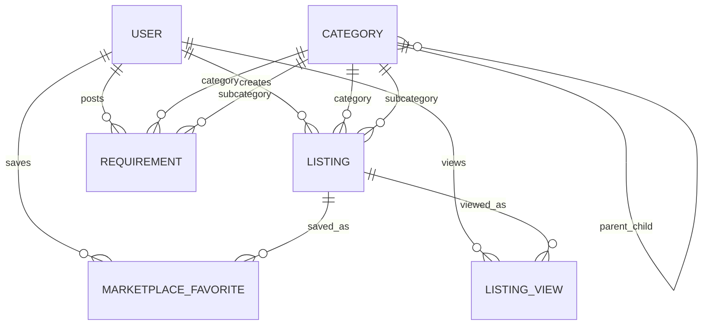

# Delala Marketplace Architecture

## Goal

Delala is evolving from a house-rental bot into a classified marketplace for:

- House rent
- House sale
- Requirements: want to rent property, want to buy any marketplace category
- Product sale: phones, laptops, tablets, electronics, vehicles, furniture, appliances, land, commercial property, and future categories

The runtime backend uses Node.js, Express, and MongoDB/Mongoose. The SQL schema in `docs/marketplace-schema.sql` is the normalized relational equivalent for planning, reporting, or a future relational migration.

## Architecture

```text
Telegram Bot / Mobile App / Web App
  -> Presentation Layer: routes, controllers, middleware, DTO validation
  -> Application Layer: services and business rules
  -> Infrastructure Layer: Mongoose models, repositories, Telegram, Firebase, storage
  -> Database: MongoDB
```

Core marketplace modules:

- `Category`: self-referencing category tree. New categories can be added without code changes.
- `Listing`: generic supply-side listing for property rent, property sale, and product sale.
- `Requirement`: demand-side marketplace requests. Want-to-rent is property-focused; want-to-buy can target any category.
- `MarketplaceFavorite`: saved marketplace listings.
- `ListingView`: analytics events and listing view counters.
- `Admin`: marketplace approval/rejection, dashboard queues, audit logs.

## Category Model

```text
Electronics
  Phones
  Laptops
  Tablets
  Accessories
Vehicles
  Cars
  Motorcycles
  Trucks
Properties
  Houses
  Apartments
  Land
  Commercial Buildings
Home & Living
  Furniture
  Appliances
Others
```

Use `npm run seed:marketplace` to seed the default tree. Subcategories are validated against their parent category before a listing is created or updated.

## Data Model



`Listing` is generic and stores common fields plus optional embedded detail objects:

- Common: title, description, listingType, categoryId, subcategoryId, price, location, images, sellerId, status.
- Property details: bedrooms, bathrooms, area, parking, furnished, propertyType.
- Product details: condition, brand, model, year, warranty.

This avoids creating a table or collection per product category.

## API Endpoints

Public and user marketplace:

- `GET /api/marketplace/categories`
- `GET /api/marketplace/listings`
- `GET /api/marketplace/listings/:id`
- `POST /api/marketplace/listings`
- `PUT /api/marketplace/listings/:id`
- `DELETE /api/marketplace/listings/:id`
- `POST /api/marketplace/listings/:id/submit`
- `GET /api/marketplace/listings/my`
- `GET /api/marketplace/listings/saved`
- `POST /api/marketplace/listings/:id/favorite`
- `DELETE /api/marketplace/listings/:id/favorite`

Admin marketplace:

- `POST /api/marketplace/categories`
- `PUT /api/marketplace/categories/:id`
- `GET /api/admin/marketplace/listings`
- `PUT /api/admin/marketplace/listings/:id/approve`
- `PUT /api/admin/marketplace/listings/:id/reject`

Search filters:

- categoryId, subcategoryId
- city, subCity
- minPrice, maxPrice
- listingType
- condition, brand
- datePosted
- status
- sort: newest, oldest, price_asc, price_desc, views, favorites

## Telegram Flow

```text
Main Menu
  Post Listing
    Property
      House for Rent
      House for Sale
    Product for Sale
      Category
      Subcategory
      Title and Description
      Price
      Location
      Brand, Model, Year
      Condition
      Contact Phone
      Images
      Submit for Admin Approval
    Requirement
      Want to Rent
        Properties
        Property subcategory
      Want to Buy
        Any marketplace category
        Subcategory
  Browse Listings
  Search
  My Listings
  Saved Listings
  Contact Support
```

The product flow now writes to the generic `Listing` model with `listingType = product_sale` and `status = pending_approval`.

## Folder Structure

```text
backend/src/
  application/
    dto/
    services/
  config/
  domain/
    enums/
  infrastructure/
    database/
      models/
      repositories/
    external/
      telegram/
      firebase/
    storage/
  presentation/
    controllers/
    middleware/
    routes/
  jobs/
  scripts/
  shared/
    errors/
    logger/
    utils/
```

This keeps controllers thin, business logic in services, data access in repositories, and external integrations isolated.

## Future Features

The current model can support:

- Premium listings and featured ads: add promotion/package collections and ranking rules.
- Admin approval: already available for marketplace listings.
- In-app chat: add conversations and messages linked to listingId and participants.
- Payment integration: add package payments linked to listingId and userId.
- Advertisement packages: add package definitions, purchases, and expiry jobs.
- Analytics dashboard: expand `ListingView`, favorite counters, and conversion events.
- Web and mobile apps: reuse the same REST API and service layer.

## Roadmap

1. Seed marketplace categories with `npm run seed:marketplace`.
2. Migrate existing property documents into generic `Listing` records.
3. Add marketplace image upload endpoints for mobile/web clients.
4. Move house rent and sale Telegram posting from the legacy `Property` model to `Listing`.
5. Add payment-backed premium and featured listing packages.
6. Build admin analytics around views, saves, approvals, and payments.
7. Add chat, reporting, and moderation tools for web/mobile.
